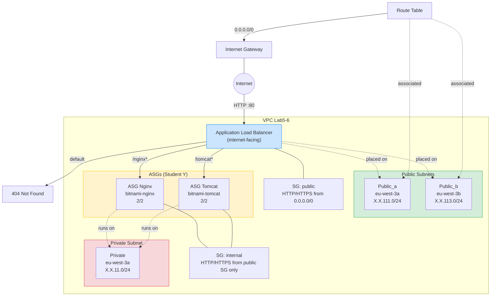

# Lab 5: Load Balancers, Subnetworks & Security Groups
Find a friend to work with. Use the default workspace for this Lab.
Create a new directory on the s3 backend called student_X_Y. Create 2 new states in a new s3 directory , network.state and ec2.state

## Student X (will use network.tfstate):
- Create 3 new subnets on the vpc named “Lab5-6” (use data source to fetch it)
- Identify the CIDR and create 3 subnets, one private, and two public, with X and Y as the “network identifiers” (i.e: 192.168.5.0/24 for private and 192.168.13.0/24 & 192.168.113.0/24 for public for student 5 and student 13)
- Place each of the public subnets in different availability zones
- Name your subnets “student_X_Y_Public_a/b/c”, student_X_Y_Public_a/b/c” and “student_X_Y_Private” respectively, a/b/c being your availability zone
- Create 2 Security group:
One allowing traffic from internet in http, https. Name it public.
One allowing traffic from the public security group only, on http/s . Name it internal.
Create a new module where you’ll create an application load balancer. Place it on the public networks.
Depending if the path called is “..../nginx” or “.../tomcat” redirect on one or the other ASG

## Student Y (will use ec2.tfstate):
Make a module that will create an ASG of t3.micro, using a launch template. Make it a configurable module where you can tune the AMI, the ASG min and max size, subnets it’s created on and the security group. Add an Application Load balancer in front of your ASG.
Instantiate your module to deploy an ASG of 2/2  on the private subnet created by student X, fetch the subnet by using a datasource that will query AWS. Associate the internal Security Group to it, fetched via datasource, with the ami with a name starting by “bitnami-nginx-…”
Instantiate your module to deploy an ASG of 2/2  on the private subnet created by student X, fetch the subnet by using a datasource that will query AWS. Associate the internal Security Group to it, fetched via datasource, with the ami with a name starting by “bitnami-tomcat-…”

## Architecture



### State Files (S3 Backend)
```
s3://terraform-state-agvq0/global/s3/student_11_9/
├── network.tfstate   ← Student X (subnets, SGs, ALB)
└── ec2.tfstate       ← Student Y (ASGs, launch templates)
```

---