# Lab 6: Database Integration & Multi-Tier Architecture 
## Objectives
- Create an RDS PostgreSQL instance in a private subnet
- Store database credentials securely using AWS Systems Manager Parameter Store
- Deploy a bastion host to connect to the database
- Practice direct database connectivity and SQL commands
- Implement proper security group configurations for multi-tier architecture
- (Bonus) Use AWS Systems Manager Session Manager for secure access without SSH keys

## Architecture

```mermaid
graph TB
    subgraph Internet
        User["User (Your IP)"]
    end

    subgraph AWS["AWS — Lab5-6 VPC"]
        subgraph Public["Public Subnet (AZ a)"]
            Bastion["Bastion Host<br/>t3.micro<br/>Amazon Linux 2"]
        end

        subgraph Private["Private Subnets (AZ a + AZ b)"]
            RDS["RDS PostgreSQL 14.7<br/>db.t3.micro<br/>labdb"]
        end

        subgraph IAM["IAM"]
            Role["Bastion Role<br/>+ Instance Profile"]
        end

        subgraph SSM["SSM Parameter Store"]
            Params["/lab6/db/host<br/>/lab6/db/port<br/>/lab6/db/name<br/>/lab6/db/username<br/>/lab6/db/password 🔒"]
        end

        BastionSG["Bastion SG<br/>Inbound: SSH :22"]
        RDSSG["RDS SG<br/>Inbound: PostgreSQL :5432<br/>from Bastion SG"]
    end

    User -->|"SSH :22"| Bastion
    Bastion -->|"psql :5432"| RDS
    Bastion -.->|"GetParameter"| Params
    Role -.->|"attached to"| Bastion
    BastionSG -.->|"protects"| Bastion
    RDSSG -.->|"protects"| RDS
    RDSSG -.->|"allows from"| BastionSG

    style Public fill:#d4edda,stroke:#28a745
    style Private fill:#f8d7da,stroke:#dc3545
    style SSM fill:#fff3cd,stroke:#ffc107
    style IAM fill:#d1ecf1,stroke:#17a2b8
```



**Terraform state separation:**
- **Student A** (`network_rds.tfstate`): Private subnet, RDS SG, DB subnet group, RDS instance, SSM parameters
- **Student B** (`bastion.tfstate`): Bastion SG, IAM role/profile, Bastion EC2 instance

## Prerequisites
- Work in pairs (Student A & Student B) (in theory)
- Create two separate Terraform states: network_rds.tfstate and bastion.tfstate
- Both students work in the same S3 backend directory: student_A_B/

## Student A: Database & Security Setup (uses network_rds.tfstate)
Responsibilities:
- Create RDS Security Group
Allow inbound PostgreSQL (port 5432) from a security group that will be created by Student B
Use a data source or variable for Student B's security group ID (coordinate the naming)
- Create DB Subnet Group
Use private subnets from the Lab5-6 VPC (fetch via data source)
- Create RDS PostgreSQL Instance
Instance: db.t3.micro
Engine: PostgreSQL 14.7
Storage: 20GB
Database name: labdb
Username: labadmin
In private subnets

## Student B: Bastion Host & IAM Setup (uses bastion.tfstate)
Responsibilities:
- Fetch RDS information using data sources
Query SSM parameters created by Student A
Query RDS security group created by Student A
- Create Bastion Security Group
Allow inbound SSH (port 22) from your IP
Allow all outbound
Important: Share this security group ID with Student A so they can update RDS security group rules
- Create IAM Role for Bastion
Trust policy for EC2
Policy to read SSM parameters (/lab6/db/*)
Create instance profile
- Create Bastion Host EC2 Instance
AMI: Amazon Linux 2
Instance type: t3.micro
In a public subnet (fetch via data source)
Attach IAM instance profile
User data script that:
Installs postgresql14 client
Fetches credentials from SSM
Creates connection script
- Create Outputs
Bastion public IP
SSH connection command
Bastion security group ID

## Procedure
### Step 1: Student A deploys first (partial)
- Creates RDS security group with placeholder/variable for bastion SG
- Creates RDS instance
- Creates SSM parameters
- Outputs RDS security group ID

### Step 2: Student B deploys
- Uses data sources to fetch Student A's resources
- Creates bastion security group
- Shares bastion security group ID with Student A

### Step 3: Student A updates and redeploys
- Updates RDS security group to allow traffic from Student B's bastion SG
- Uses data source or variable to reference it

### Step 4: Student B finalizes and redeploys
- Creates bastion instance
- Tests connectivity

## Validation tests
- SSH into bastion
- Run connection script to access RDS
- Create tables and insert data
- Verify data persistence
- Test security (try connecting without proper SG rules)

---

## Instructions

### Project Structure

```
lab6/
  README.md
  student_A/          # State: network_rds.tfstate
    providers.tf
    variables.tf
    data.tf
    rds.tf
    ssm.tf
    outputs.tf
  student_B/          # State: bastion.tfstate
    providers.tf
    variables.tf
    data.tf
    iam.tf
    bastion.tf
    outputs.tf
```

---

### Student A: Step-by-step

#### 1. Initialize and deploy (first pass — no bastion SG yet)

```bash
cd lab6/student_A
terraform init
terraform apply \
  -var='student_X=11' \
  -var='student_Y=9' \
  -var='db_password=YourSecurePassword123!'
```

`bastion_sg_id` defaults to `""`, so the RDS security group is created **without** an ingress rule. RDS creation takes ~10 minutes.

Once done, tell Student B they can deploy (the SSM parameters now exist).

#### 2. Wait for Student B

Student B deploys and gives you their `bastion_sg_id`.

#### 3. Redeploy with the bastion SG

```bash
terraform apply \
  -var='student_X=11' \
  -var='student_Y=9' \
  -var='db_password=YourSecurePassword123!' \
  -var='bastion_sg_id=sg-yyyyyyyyy'
```

This adds the ingress rule: allow PostgreSQL (5432) from the bastion security group.

#### Key files

| File | What it does |
|---|---|
| `providers.tf` | S3 backend (`network_rds.tfstate`), AWS provider |
| `variables.tf` | Region, student IDs, DB credentials (`db_password` is sensitive), `bastion_sg_id` |
| `data.tf` | Fetches Lab5-6 VPC and existing private subnets; creates a 2nd private subnet in AZ b (RDS needs subnets in 2+ AZs) |
| `rds.tf` | RDS security group + conditional ingress rule, DB subnet group, PostgreSQL 14.7 instance |
| `ssm.tf` | Stores DB host, port, name, username, password in SSM Parameter Store (`/lab6/db/*`) |
| `outputs.tf` | RDS security group ID, endpoint, address, port, DB name |

---

### Student B: Step-by-step

> **Prerequisite:** Student A must have deployed first (SSM parameters must exist).

#### 1. Initialize and deploy

```bash
cd lab6/student_B
terraform init
terraform apply \
  -var='student_X=11' \
  -var='student_Y=9' \
  -var='my_ip=YOUR_PUBLIC_IP/32' \
  -var='key_name=your-key-pair-name'
```

Once done, note the output and share it with Student A:
```
bastion_sg_id = "sg-yyyyyyyyy"
```

Then wait for Student A to redeploy with your SG ID (Step 3 above).

#### 2. Test connectivity

After Student A has updated the RDS security group:

```bash
# SSH into the bastion
ssh -i your-key.pem ec2-user@<bastion_public_ip>

# Run the connection script (installed by user data)
./connect_db.sh

# Inside psql — create a table and verify
CREATE TABLE students (id SERIAL PRIMARY KEY, name VARCHAR(100));
INSERT INTO students (name) VALUES ('Student A'), ('Student B');
SELECT * FROM students;

# Exit and reconnect to verify persistence
\q
./connect_db.sh
SELECT * FROM students;
```

#### Key files

| File | What it does |
|---|---|
| `providers.tf` | S3 backend (`bastion.tfstate`), AWS provider |
| `variables.tf` | Region, student IDs, `my_ip` (CIDR for SSH), `key_name` (EC2 key pair) |
| `data.tf` | Fetches Lab5-6 VPC, public subnets, SSM parameters from Student A, Amazon Linux 2 AMI |
| `iam.tf` | IAM role (EC2 trust policy), inline policy (`ssm:GetParameter` on `/lab6/db/*` + `kms:Decrypt`), instance profile |
| `bastion.tf` | Bastion security group (SSH inbound, all outbound) + EC2 instance with user data (installs psql14, creates `connect_db.sh`) |
| `outputs.tf` | Bastion public IP, SSH command, bastion security group ID |

---

### Cleanup

Destroy in **reverse order** (Student B first, then Student A):

```bash
# Student B
cd lab6/student_B
terraform destroy \
  -var='student_X=11' \
  -var='student_Y=9' \
  -var='my_ip=YOUR_PUBLIC_IP/32' \
  -var='key_name=your-key-pair-name'

# Student A
cd lab6/student_A
terraform destroy \
  -var='student_X=11' \
  -var='student_Y=9' \
  -var='db_password=YourSecurePassword123!'
```